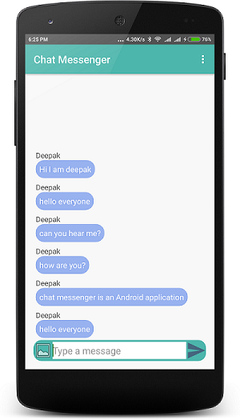

# FriendlyChat

This repository contains code for the FriendlyChat project in the [Firebase in a Weekend: Android by Google](https://www.udacity.com/course/firebase-in-a-weekend-by-google-android--ud0352) Udacity course.

### Commits : 

- Commit 1   :  Intial commit [  Added basic functionality, group chatting ] 
- Commit 2   :  Updated User Interface 

### ScreenShot of sample android app 

## License
See [LICENSE](LICENSE)
